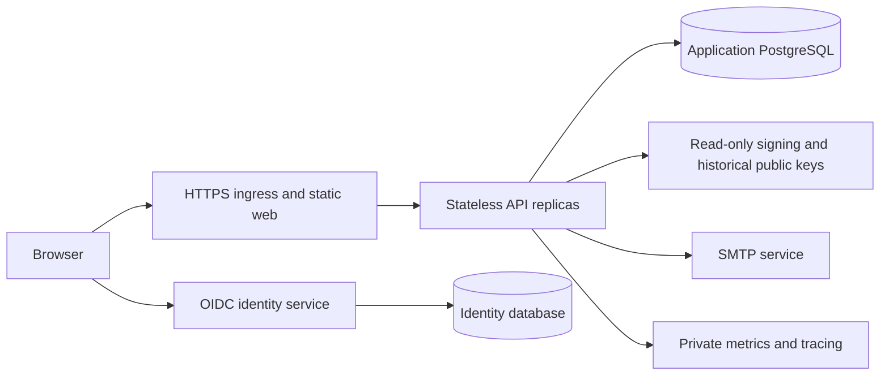

# Architecture

Signet Campus is a Kotlin application with a React client. The server keeps assessment rules and use cases independent of HTTP, PostgreSQL and credential-library adapters. It can run as multiple stateless API instances over shared durable state.

## Code boundaries

| Layer | Responsibility |
|---|---|
| `domain` | Evidence submission, review and resubmission invariants |
| `application` | Catalog, submission, pathway and credential use cases; repository, cryptography and notification ports |
| `adapter/web` | HTTP requests, responses, safe errors and request observations |
| `adapter/security` | OIDC issuer/audience validation and reviewer authorization |
| `adapter/persistence` | PostgreSQL transactions, optimistic versions, row locks, unique constraints and outbox dispatch |
| `adapter/credential` | Published Signet starter integration and portable badge images |
| `adapter/notification` | Spring Mail transport and scheduled outbox delivery |
| `CampusApplication` | Spring composition and UTC clock injection |

Konsist checks that domain imports use only domain types and the standard library, and application imports do not depend on frameworks or adapters. React uses TanStack Query for server data and cache invalidation; Zustand owns workspace navigation and selection. Keycloak manages browser login with authorization code flow and PKCE; tokens stay in memory.

## Durable state and concurrency

PostgreSQL stores achievements, evidence, review audit snapshots, enrollments, credentials, revocation, sharing and notification events. Flyway applies versioned migrations. Signed credential documents are immutable: later sharing, archival and revocation change registry state without rewriting the proof.

Optimistic versions reject competing reviews and stale catalog writes. Database constraints make issuance and enrollment idempotent across instances. Achievement row locks serialize archival against new work. Eligibility decisions use a database statement snapshot; later changes do not retroactively alter an already-issued completion award.

Notification workers use `FOR UPDATE SKIP LOCKED`. Delivery is at least once: SMTP acceptance followed by a failed database commit can produce a duplicate. The stable Message-ID identifies the logical event. There is no process-local queue or exactly-once claim. See [notifications](NOTIFICATIONS.md) and the [two-instance crash rehearsal](REPLICAS.md).

## Deployment topology

The local base deployment runs one API, PostgreSQL, Keycloak's development store and Mailpit on loopback ports. The [HTTPS overlay](HTTPS.md) exposes only its ingress; [identity recovery](IDENTITY_RECOVERY.md) exercises a separate PostgreSQL-backed identity service. The replica fixture proves shared-state behavior and worker recovery by addressing two processes directly. It does not automatically route traffic after an instance fails.

For a service deployment, place stateless API replicas behind health-aware ingress and keep database and management ports private. Preserve the public issuer origin, OIDC issuer and account subjects across upgrades. Use persistent identity storage, production identity settings and exact redirect allowlists. Provision the same active signing configuration and retained public keys to every replica before rotation. The current adapter reads JWK files at startup; the application cryptography port is the boundary for a future KMS adapter.

Use protected credentials, trusted certificates with renewal, an approved SMTP service, appropriate tracing sampling and network policies. The app supports graceful shutdown and health probes; configure ingress draining and restart behavior for the deployment platform. With the telemetry overlay, health and metrics use management port 9091 and must remain private. Collectors are optional for issuance.

Back up application data, key material, identity data and deployment configuration together. Validate [application recovery](RECOVERY.md) and [identity recovery](IDENTITY_RECOVERY.md) before cutover. Database failover, continuous WAL archiving, regional recovery and traffic failover need deployment-specific infrastructure and measured recovery objectives; local Compose rehearsals do not provide them.
